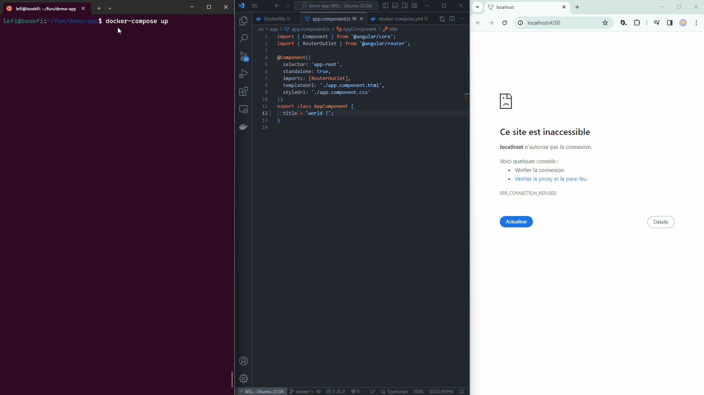

# angular-hot-reload-template

This project was generated with [Angular CLI](https://github.com/angular/angular-cli) version 17.2.0.

It is a template app for hot reloading of an Angular app with Docker.

## Overview



## Prerequisite
Make sure you have installed Docker, and the ```docker-compose``` command.

## Get started

Build the app
```bash
docker-compose build
```

Run
```bash
docker-compose up
```
Then, navigate to `http://localhost:4200/`. 

The application will automatically reload if you change any of the source files.